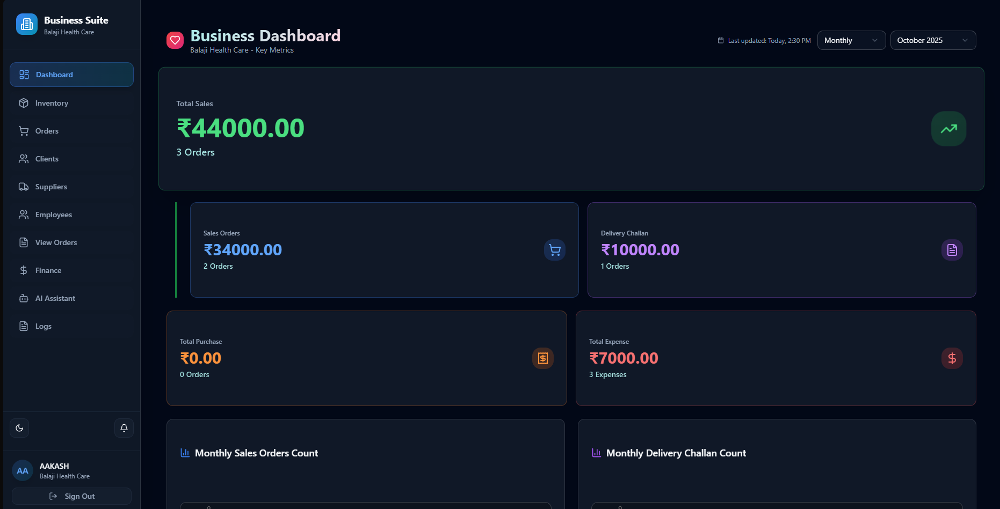
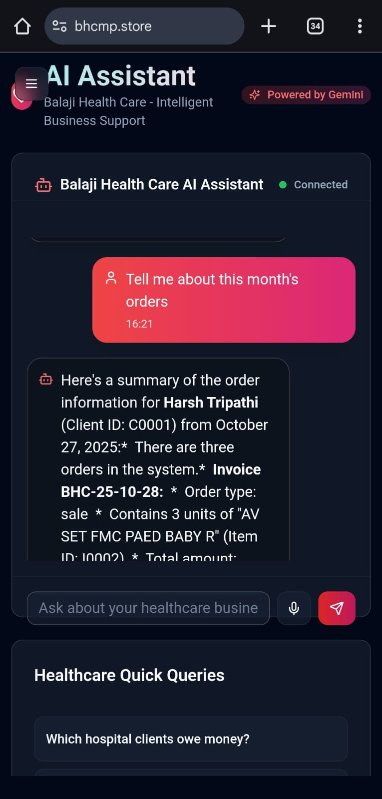
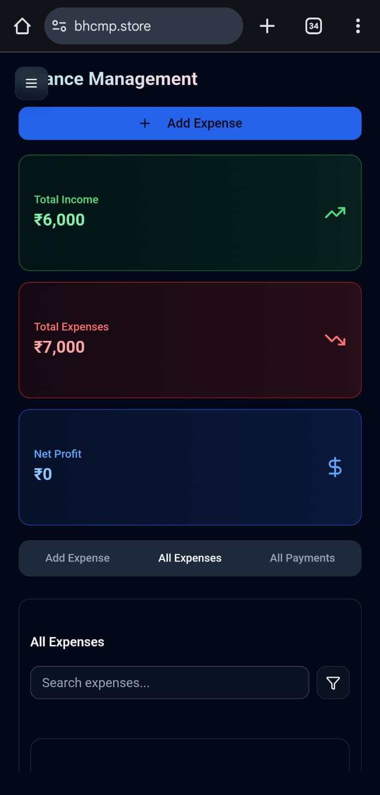
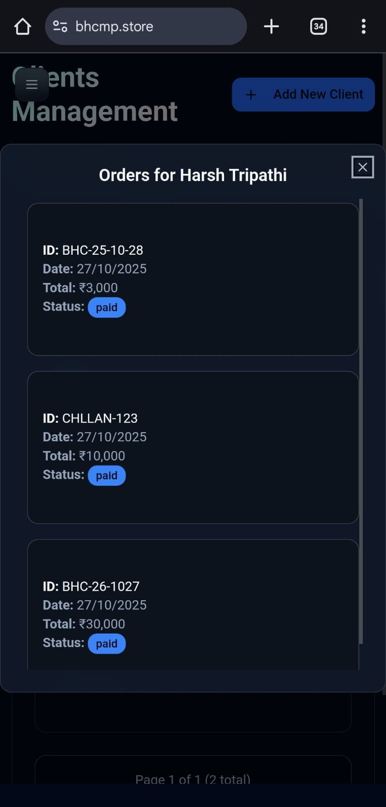

# BHC (Balaji Health Care) Business Suite


**A full-stack, AI-enhanced web application built to modernize and centralize the complete operational workflow for Balaji Health Care.**

<br>

<p align="center">
  
  
  
  
  
  
  
  
</p>

<p align="center">
  <a href="https://bhcmp.store" target="_blank">
    
  </a>
  &nbsp;
  <a href="https://youtu.be/XTlps8ep0D8" target="_blank">
    
  </a>
  &nbsp;
  <a href="https://round-story-935.notion.site/BHC-Balaji-Health-Care-Business-Suite-Documentation-27d2c96307f780b0beadcda0cc649a05?pvs=74" target="_blank">
    
  </a>
</p>

---

## Executive Summary

The BHC (Balaji Health Care) Business Suite is a full-stack, AI-enhanced web application built to modernize and centralize the complete operational workflow for Balaji Health Care, a specialized medical supply company. It replaces manual, fragmented processes with a single, real-time digital hub.

The suite provides end-to-end management of inventory (including batch and expiry tracking), complex order types (sales, purchases, delivery challans), client and supplier accounts, and financial records. The primary outcome is a significant increase in operational efficiency, data accuracy, and business insight, driven by a unified dashboard and an intelligent AI assistant.

### Key Results
* **Time Saved:** Estimated reduction in time spent on manual data entry, primarily due to the AI-powered invoice scanning feature which automates the creation of order forms from PDF documents.
* **Error Reduction:** A significant decrease in inventory and financial discrepancies by centralizing data and automating calculations for stock levels and client dues, eliminating manual tracking errors.
* **Improved Financial Visibility:** Real-time tracking of total income, expenses, and net profit on the main dashboard has improved financial oversight and enabled faster decision-making. Dues from clients are now tracked automatically, improving the potential for timely revenue collection.

---

## 📸 Application Preview

*(Replace these with your own screenshots)*

| Dashboard | AI Chatbot |
| :---: | :---: |
|  |  |
| **Finance Management** | **Order View** |
|  |  |

---

## 🌟 Key Features

| Backend (FastAPI) | AI & Chatbot (LangChain) | Frontend (Next.js) |
| :--- | :--- | :--- |
| 🗃️ **Full Business CRUD** | 🤖 **Conversational Agent** | 🖥️ **Modern UI/UX (shadcn/ui)** |
| 📦 **Advanced Order Management** | 🛠️ **Database Tools** | 📱 **Responsive Design** |
| 🧾 **Automated Accounting** | 🧠 **Semantic Search (LlamaIndex)** | 📊 **Dashboard & Charts** |
| 🏭 **Inventory Control (Batch & Expiry)** | 🤖 **AI-Powered Summaries** | 💬 **Streaming AI Chat UI** |
| 📊 **Dashboard & Stats API** | 🔊 **Voice Input (Speech-to-Text)** | 🎨 **Dark Mode Support** |
| 📄 **PDF Invoice Scanning** | | 🔐 **Login & Auth Flow** |
| 🔐 **Authentication (Bcrypt)** | | 📝 **Full Data Management** |
| ☁️ **Google Drive Integration** | | 🔔 **System Notifications** |
| 🪵 **Centralized Logging** | | |

---

## 🚀 Architecture & Core Concepts

BHC suite is built on a modern, decoupled architecture, separating the user interface (frontend) from the business logic and data layer (backend).

### 1. Backend (FastAPI)
The backend serves as the BHC Suite's engine, built with Python and FastAPI. It provides a robust, scalable foundation that acts as the single source of truth for all business logic and data.
* **FastAPI:** Chosen for high performance, async capabilities, and automatic API documentation.
* **Pydantic:** Used for all data validation, ensuring no malformed data reaches the database.
* **Service Classes:** Business logic is encapsulated in services (e.g., `InventoryService`, `ClientService`) to handle complex operations like stock updates and dues calculations atomically.
* **Firebase Admin SDK:** Provides a secure, direct connection to the Firestore database.

### 2. Frontend (Next.js)
The frontend is a responsive Single-Page Application (SPA) that renders the user interface and manages all user interactions.
* **Next.js 15 (Turbopack):** Provides a fast, modern React framework for the UI.
* **shadcn/ui & Radix:** Used to build a comprehensive, accessible, and beautiful component library.
* **Tailwind CSS:** For utility-first styling.
* **Recharts:** Renders the interactive financial charts on the dashboard.

### 3. Core Optimization: The `doc_counters` Strategy
A key challenge with NoSQL databases like Firestore is performing aggregate calculations (like `SUM()` or `COUNT()`). Reading every order document just to get "Total Sales" is slow and expensive.

**Solution:** This application uses a dedicated `doc_counters` collection in Firestore. This collection acts as a real-time ledger.
* **On Create/Delete:** When a new sales order is created, the backend performs a single **atomic `Increment` operation** on the `doc_counters/orders` document.
* **The Result:** The dashboard reads from this *one* summary document instead of thousands of order documents.
* **The Impact:** This strategy reduces the read cost for all dashboard metrics from **O(n)** to **O(1)**, making the dashboard load instantly and keeping Firebase costs near zero.

---

## 🧠 Feature Deep Dive: The AI Assistant
The AI assistant is not just a chatbot; it's an expert colleague with instant access to the entire business database. It was built to solve the "token limit" problem—we can't send the entire database to the AI on every query.

This was achieved using a **Retrieval-Augmented Generation (RAG)** pipeline:

1.  **The "Book" (LlamaIndex & Qdrant):** We use `LlamaIndex` to read every document (Client, Order, etc.) and convert its *meaning* into a numerical vector embedding. These embeddings are stored in a **Qdrant Vector Database**.
2.  **The "Librarian" (Semantic Search):** When you ask, "Which clients haven't paid?" LlamaIndex finds the most relevant documents from Qdrant—even if they don't contain those exact words.
3.  **The "Brain" (LangChain Agent):** The agent decides what to do. For a simple query like "Get invoice 101," it uses a precise tool (`get_order_by_id`). For a complex query like "Are we running low on supplies?" it uses the semantic "Librarian" (LlamaIndex) to find the answer.
4.  **The "Experience" (Streaming):** The backend uses a `StreamingResponse` so the AI's answer appears on your screen word-by-word, creating a natural, conversational feel.

---

## Feature Deep Dive: Automated Nightly SMS Briefing

To provide immediate, end-of-day insights without needing a login, we built an automated AI briefing delivered via SMS.

1.  **The Scheduler (PythonAnywhere):** A free-tier task is scheduled to run a Python script at 10 PM IST daily.
2.  **The Brain (Google Gemini):** The script fetches the day's key metrics from Firestore (sales, expenses, new orders) and prompts Gemini to write a professional, concise summary.
3.  **The Smart Check:** The script checks the summary's length. If it's over the 300-character SMS limit, it re-prompts Gemini: "Make this more concise."
4.  **The Messenger (Twilio):** Once the summary is perfectly sized, it's sent to the business owner's phone via the Twilio API.

This zero-cost, serverless feature provides a high-value, intelligent daily summary, embodying the project's goal of proactive, efficient business management.

---

## 🚀 Getting Started

This is a monorepo project. You will need to run the `backendd` and `ui` services separately.

### 1. Backend (`backendd`)

The backend is a Python-based FastAPI server.

1.  **Navigate to the backend directory:**
    ```bash
    cd backendd
    ```

2.  **Create a virtual environment and install dependencies:**
    ```bash
    python -m venv venv
    source venv/bin/activate  # On Windows: venv\Scripts\activate
    pip install -r requirements.txt
    ```

3.  **Set up Environment Variables:**
    Create a `.env` file in the `backendd` directory. You will need:
    * `FIREBASE_CREDENTIALS_PATH`: Path to your Firebase service account key (`.json`).
    * `SECRET_KEY`: A strong, random secret key.
    * `GOOGLE_API_KEY`: Your Google Gemini API key.
    * `GOOGLE_CLIENT_ID`, `GOOGLE_CLIENT_SECRET`: For Google Drive OAuth.
    * `DRIVE_FOLDER_ID`: The ID of the Google Drive folder to upload files to.
    * `QDRANT_URL`, `QDRANT_API_KEY`: Credentials for your Qdrant Cloud instance.

4.  **Run the server:**
    The main application file is `test.py`.
    ```bash
    uvicorn test:app --reload --port 8000
    ```
    The API documentation will be available at [http://localhost:8000/docs](http://localhost:8000/docs).

### 2. Frontend (`ui`)

The frontend is a Next.js application.

1.  **Navigate to the UI directory:**
    ```bash
    cd ui
    ```

2.  **Install dependencies (using pnpm):**
    ```bash
    pnpm install
    ```

3.  **Set up Environment Variables:**
    Create a `.env.local` file in the `ui` directory:
    ```
    NEXT_PUBLIC_API_URL=http://localhost:8000
    NEXT_PUBLIC_API_BASE_URL=http://localhost:8000

    # This key is for the *client-side* AI chat component (if different from backend)
    GOOGLE_GENERATIVE_AI_API_KEY=your_google_ai_key
    ```

4.  **Run the development server:**
    ```bash
    pnpm run dev
    ```

5.  Open [http://localhost:3000](http://localhost:3000) in your browser.

---

## 📚 Full Documentation

For a complete breakdown of every module, feature, data model, and business rule, please see the full project documentation on Notion:

**[BHC Business Suite - Full Documentation](https://round-story-935.notion.site/BHC-Balaji-Health-Care-Business-Suite-Documentation-27d2c96307f780b0beadcda0cc649a05?pvs=74)**
